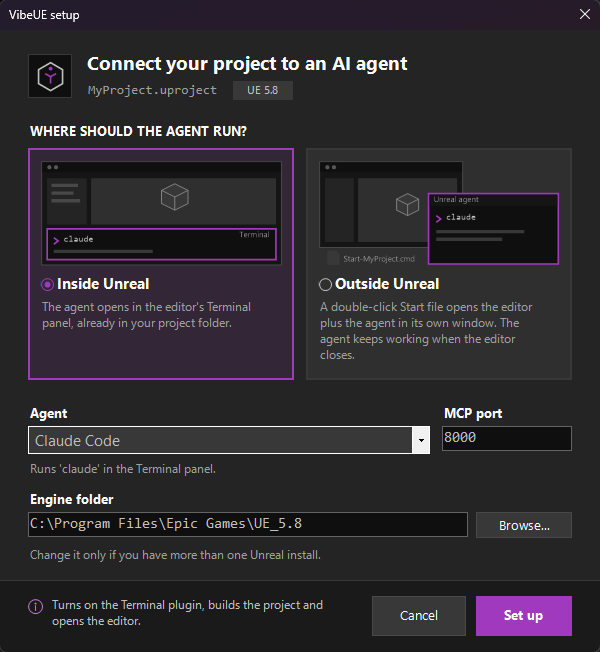

# Unreal MCP Setup

One-click setup that turns a freshly created Unreal Engine 5.8 (or 5.7) project into one your AI agent
can drive through MCP. It clones the [VibeUE](https://github.com/kevinpbuckley/VibeUE) plugin, enables
the engine's MCP plugins, writes the MCP server and client settings, builds the plugin and opens the
editor. It replaces about ten manual steps (clone plugin, enable plugins, editor preferences, console
commands, build, git) with one double-click.

You choose where the agent runs:

- **Inside Unreal:** the agent starts in the editor's Terminal panel, already in the project folder.
- **Outside Unreal:** the script creates a double-click `Start-<Project>` shortcut (with a purple
  Unreal icon) that opens the editor and the agent in its own window. The agent keeps working while
  the editor is closed, for example during rebuilds.

<p align="center"></p>

## Requirements

- Windows 10 or 11
- Unreal Engine 5.8 (or 5.7) from the Epic Games Launcher or a source build
- [Git for Windows](https://git-scm.com/download/win). If it is missing, `setup-vibeue.cmd` offers to install it with `winget`.
- Visual Studio 2022 (17.8 or newer) or 2026 with C++ tools, Community or Build Tools. VibeUE ships as
  source code, so it must be compiled. If no C++ toolchain is found, the script offers to install
  Visual Studio 2022 Build Tools with `winget`.
- Internet access (the plugin is cloned from GitHub)
- Your agent's command-line tool, for example [Claude Code](https://docs.anthropic.com/en/docs/claude-code),
  if you want the script to start it for you (in the editor's Terminal panel or in its own window)

## Quick start

1. Create a new project in Unreal Engine 5.8 (Blueprint or C++), then **close the editor**.
2. Get `setup-vibeue.cmd` and `setup-vibeue.sh`: use **Code → Download ZIP** on this page, or
   `git clone https://github.com/JavorMin/unreal-mcp-setup.git`. Don't save the files one by one from
   the "Raw" view: that can give the `.cmd` file the wrong line endings.
3. Copy both files into your project folder, next to the `.uproject` file.
4. Double-click `setup-vibeue.cmd`.
5. In the setup window, check the values and click **Set up**:

   | Field | Meaning |
   |---|---|
   | Where should the agent run? | **Inside Unreal** (editor Terminal panel) or **Outside Unreal** (double-click Start shortcut). Click anywhere on a card to pick it |
   | Agent | Claude Code, Cursor, VS Code, Gemini CLI, Codex, or All of them. The hint below it says what will start |
   | MCP port | MCP server port. Default `8000` on 5.8, `8088` on 5.7 |
   | Engine folder | Found automatically; change it or use **Browse...** if it is wrong |
   | VibeUE API key | Only shown for 5.7. **Get a free key** opens [vibeue.com/login](https://www.vibeue.com/login): sign in with Google, copy your free key and paste it here |

6. Wait while the plugin is cloned and built. The editor then opens with the MCP server running.
7. Start the agent:
   - **Inside Unreal:** in the editor, open **Tools → Terminal**. Your agent starts in the project folder.
   - **Outside Unreal:** the agent window opens together with the editor. Next time, double-click
     `Start-<Project>` in the project folder.

## What the script changes in your project

| File / folder | Change |
|---|---|
| `Plugins/VibeUE/` | VibeUE cloned from GitHub (branch `5-8` or `5-7`). Skipped if a VibeUE plugin is already in `Plugins/`. |
| `<Project>.uproject` | 5.8: enables `ModelContextProtocol`, `AllToolsets`, `EditorToolset`. `Terminal` is enabled inside Unreal and disabled outside |
| `Config/DefaultEditorPerProjectUserSettings.ini` | 5.8: MCP server auto-start on, port, path `/mcp`, tool search on. 5.7: VibeUE's own MCP server (`[VibeUE.MCPServer]` Enabled, Port) |
| `Saved/Config/WindowsEditor/EditorPerProjectUserSettings.ini` | 5.8, inside Unreal: Terminal startup commands: `set TERM=xterm-256color`, `cd /d "<project folder>"`, then `claude`, `gemini` or `codex` (no command for Cursor / VS Code). 5.7: the VibeUE API key, if you gave one |
| `Start-<Project>.cmd` | Outside Unreal: opens the editor, and a PowerShell window that waits for the MCP server and then starts `claude`, `gemini` or `codex` (a plain shell for Cursor / VS Code) |
| `Start-<Project>.lnk` + `Saved/VibeUE/Start.ico` | Outside Unreal: a shortcut to the `.cmd` with the `.uproject` icon recolored Unreal purple  (a `.cmd` file can't have its own icon) |
| `.mcp.json` + `.claude/settings.local.json` | Claude Code: server `unreal-mcp`, enabled without an approval prompt |
| `.cursor/mcp.json` | Cursor |
| `.vscode/mcp.json` | VS Code |
| `.gemini/settings.json` | Gemini CLI |
| `.codex/config.toml` | Codex. Only created if the file does not exist; otherwise the script prints the lines to add by hand |
| `CLAUDE.md` / `AGENTS.md` / `GEMINI.md` | VibeUE's agent guide, inside `<!-- BEGIN VibeUE … -->` / `<!-- END VibeUE -->` markers. Your own text in these files is kept |
| `.gitignore` | Unreal's standard ignores plus the plugin folder (`/Plugins/VibeUE/`) |
| `.git` | `git init` and an initial commit, only if the folder is not a git repo with commits yet |

All MCP client configs point to `http://127.0.0.1:<port>/mcp` with the server name `unreal-mcp`.
Existing JSON config files are merged, not replaced.

Then the script builds the project with the engine's `Build.bat` and launches the editor.

The Terminal startup commands and the Start icon go in `Saved/` because they depend on the absolute
path of the project folder, which is different on each machine. For the same reason the Start
shortcut only works on the machine that ran the setup; `Start-<Project>.cmd` works anywhere.

## Using it with your agent

- **Inside Unreal (5.8):** open **Tools → Terminal**. The agent starts in the project folder.
  5.7 has no Terminal panel; the MCP connection is still set up.
- **Outside Unreal:** double-click `Start-<Project>`. The editor opens, and the agent starts in its
  own window as soon as the MCP server is up. That window stays open when you close the editor.
- Or open any terminal in the project folder and run your agent (for example `claude`).
- In Claude Code, run `/mcp`. `unreal-mcp` should show as connected.
- Try a first prompt such as: *"What actors do I have selected?"*

The editor must be running for the agent to reach it.

## Command-line options

`setup-vibeue.cmd` and `bash setup-vibeue.sh` accept the same options:

| Option | Meaning |
|---|---|
| `--agent X` | `ClaudeCode`, `Cursor`, `VSCode`, `Gemini`, `Codex` or `All` |
| `--port N` | MCP server port |
| `--engine DIR` | Engine folder (also read from the `UE_ENGINE_PATH` environment variable) |
| `--api-key KEY` | VibeUE API key (5.7) |
| `--internal` | Agent runs inside Unreal (editor Terminal panel) |
| `--external` | Agent runs outside Unreal (`Start-<Project>` shortcut) |
| `--no-gui` | No setup window: use the options given, and ask in the console for the rest (the default for where the agent runs is inside) |
| `--no-build` | Only write the configuration; do not build or launch |
| `path\to\Project.uproject` | Use this project instead of the one next to the script |

Example:

```
setup-vibeue.cmd --no-gui --agent ClaudeCode --port 8000 --external
```

The engine is found in this order: `--engine` / `UE_ENGINE_PATH`, the Windows registry (source builds
and launcher installs), then the Epic Games Launcher's install list.

## Re-running and changing settings

The script is safe to run again. Every file edit is an update-in-place, so a re-run with the same
choices changes nothing. Re-run it to:

- change the agent or the port,
- switch between inside and outside Unreal (switching to inside leaves the old `Start-<Project>`
  files in place; delete them if you don't need them),
- update the Terminal startup path or the Start shortcut after you move the project folder,
- set up the project on another machine or after a fresh clone (the plugin folder is git-ignored,
  so it is cloned again).

## Troubleshooting

| Problem | Fix |
|---|---|
| Build failed | Close this project's editor and run the script again. With a source-built engine, close every editor of that engine (Live Coding blocks builds). The error message shows the path of the Unreal Build Tool log. |
| Engine not found | Pass the engine folder: `setup-vibeue.cmd --engine "C:\Program Files\Epic Games\UE_5.8"` |
| "not a valid Unreal project name" | Rename the `.uproject`: it must start with a letter and contain only letters, digits and `_` (no spaces). |
| "skipped the initial commit" | Set your git identity, then run the script again: `git config --global user.name "Your Name"` and `git config --global user.email "you@example.com"` |
| Setup window does not appear or misbehaves | Use `--no-gui` |
| Agent does not start (Terminal panel or agent window) | Install its CLI (the script prints a note if `claude`, `gemini` or `codex` is not on `PATH`) |
| No `Start-<Project>` shortcut, only the `.cmd` | Creating the icon failed (the script prints why). The `.cmd` does the same job; double-click it instead |
| Start shortcut stopped working | You moved the project folder or cleaned `Saved/`. Run the setup again |

## Notes

- **5.7 is legacy.** 5.7 has no engine MCP plugin, so VibeUE runs its own MCP server, and tool
  execution and AI Chat need a free VibeUE API key. The script stores the key under `Saved/`, which is
  git-ignored, so it never ends up in your project's commits. Keep it private: it is tied to your
  vibeue.com account.
- **The MCP server listens only on your own machine (127.0.0.1) and has no authentication.** This is
  how Epic designed it.
- **Don't commit `Saved/`.** It holds machine-specific settings; the script adds it to `.gitignore`.
- Paths with spaces and non-ASCII characters work. The scripts also work if Git checks them out
  with CRLF line endings.
- The setup window uses Unreal Editor's dark theme. It is drawn at fixed pixel sizes, so on displays
  scaled above 100% Windows enlarges it and it looks slightly soft.
- Not yet verified: clicking through the setup window by hand (use `--no-gui` if it misbehaves), and
  macOS / Linux (the configuration steps may run, but build and launch are Windows-only).

## Credits

- [VibeUE](https://github.com/kevinpbuckley/VibeUE) by Kevin Buckley.
- Unreal MCP setup follows Epic's documentation:
  [Unreal MCP in the Unreal Editor](https://dev.epicgames.com/documentation/unreal-engine/unreal-mcp-in-unreal-editor).

Unreal Engine is a trademark of Epic Games; this project is not affiliated with Epic Games or VibeUE.

## License

[Apache License 2.0](LICENSE)
